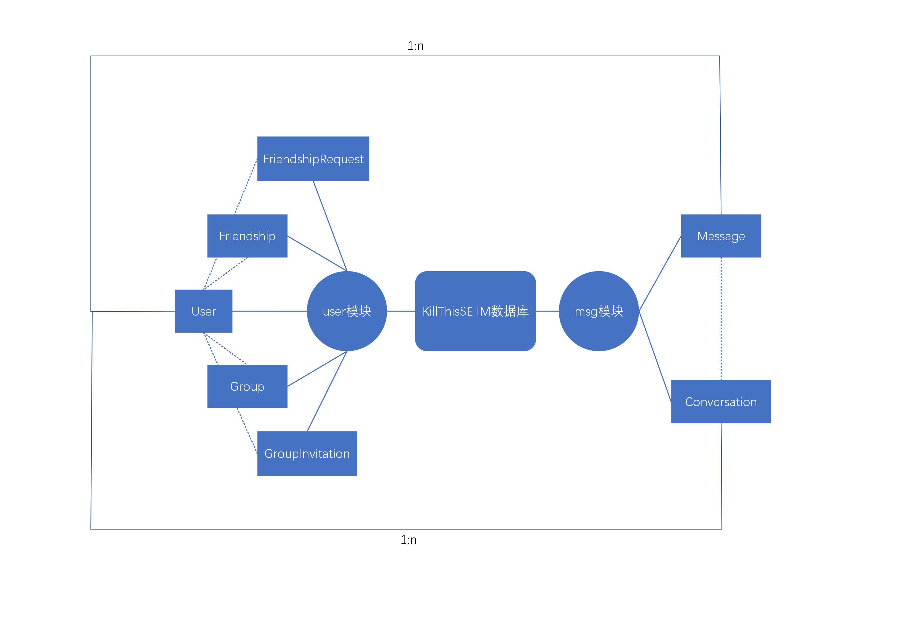

# 概述

## 数据库选型

在开发环境下，为了更便捷的使用django框架，我们使用了django自带的SQlite作为数据库。在部署环境下，我们使用了更加迅速，移植性更好的MySQL作为数据库。在项目中，我们使用了django自带的ORM作为对象关系映射框架。

## 数据表概览

| 表名                  | 说明                                                       | 所属模块 |
| --------------------- | ---------------------------------------------------------- | -------- |
| User              | 用户，继承于Django自带的 AbstractUser                  | user |
| Friendship        | 好友关系                                                   | user |
| FriendshipRequest | 好友请求                                                   | user |
| Group             | 好友分组                                                   | user |
| GroupInvitation   | 群聊邀请（注意这里的 Group和上面的 Group含义不同） | user |
| Conversation      | 会话（包括私聊与群聊）                                     | msg  |
| Message           | 消息                                                       | msg  |

!!! note "关于各个模块的具体功能请见详细的文档"

## ER图

