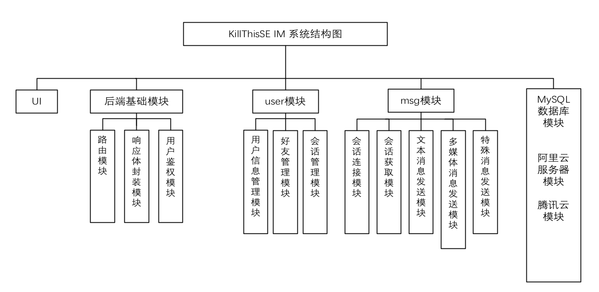
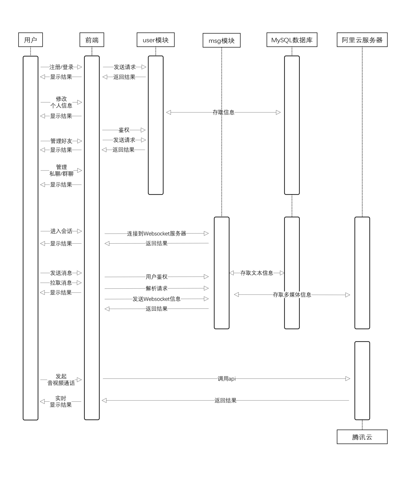
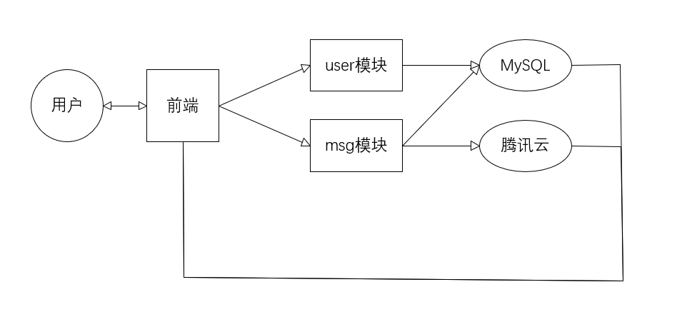

# 模块设计

KillThisSE IM在整体架构上采用了前后端分离的设计思路，前端负责与用户直接交互，进行数据的获取与展示；后端负责数据的整合处理，并且在过程中与数据库交换信息。

## 模块概览

在KillThisSE IM中，包含如下 `TODO`个模块：

- 前端

    - UI模块。尽可能地提升用户的体验，完善与用户的交互功能。
    - `TODO`

- 后端

    - 后端基础模块。提供路由、应答体封装、用户鉴权功能。
    - `user`模块。提供用户信息管理、好友管理、会话管理功能。
    - `msg`模块。提供会话信息储存、消息信息储存、即时通讯服务器连接、消息发送、消息接受功能。

- 数据库

    - MySQL模块，包含所有表及表项，提供所有信息的存储功能。
    - 阿里云服务器模块，储存多媒体信息的文件内容。

## 模块设计细节

### UI模块

### 后端基础模块

后端基础模块可以解耦为：

- 路由模块
- 响应体封装模块
- 用户鉴权模块

#### 路由模块

路由模块处理收到的HTTPS以及Websocket请求的路径。对于HTTPS请求，路由模块将其转交给对应的视图函数；对于Websocket请求，路由模块将其交给对应的消费者进行处理。

#### 响应体封装模块

响应体模块封装了请求成功与请求失败的应答体，为其他模块进行服务。

#### 用户鉴权模块

用户鉴权模块提供了以下功能：

- 在登陆时将用户与独一无二的Token绑定，将绑定的Token返回给前端。
- 提供鉴权的装饰器函数，检查请求体中的Token信息，在user模块与msg模块中起验证身份的作用。

### `user`模块

`user`模块可以解耦为：

- 用户信息管理模块
- 好友管理模块
- 会话管理模块

#### 用户信息管理模块

用户信息管理模块提供用户注册注销、登入登出，修改个人基本信息的功能。

#### 好友管理模块

好友管理模块通过在数据库中建立、查询好友关系、好友请求表项，实现好友的管理、分组功能。

#### 会话管理模块

会话管理模块提供用户获取会话基本信息，管理会话属性，（群主与管理员）管理群聊的功能；与msg模块共同完成即时通讯服务。

### `msg`模块

`msg`模块可以解耦为：

- 会话连接模块
- 会话获取模块
- 文本消息发送模块
- 多媒体消息发送模块
- 特殊类型消息发送模块

#### 会话连接模块

会话连接模块处理WebSocket请求，识别用户身份及会话信息，并提供用户连接到特定会话，鉴权用户信息的功能。

#### 会话获取模块

会话获取模块在用户已经成功连接到会话的前提下，提供用户获取当前会话所有消息详细信息的功能，与三个消息发送模块共同完成消息的收发功能。

#### 文本消息发送模块

文本消息发送模块提供用户在会话中发送简单文本信息的功能。

#### 多媒体消息发送模块

多媒体消息发送模块解析WebSocket消息中的参数，提供用户在会话中发送多媒体消息的功能，与阿里云服务器模块提供了多媒体消息的储存功能。

#### 特殊类型消息发送模块

特殊类型消息发送模块解析Websocket消息中的参数，识别用户对于消息的拓展需求（如撤回、转发、引用），并实时反馈给前端。

### MySQL模块

MySQL模块负责用户信息、好友关系、会话信息以及消息列表的持久化储存。

### 阿里云服务器模块

阿里云服务器模块负责多媒体类型消息的持久化储存，以及部分图片的托管服务。

## 系统结构相关图示

系统结构图

流程图

数据流向图

