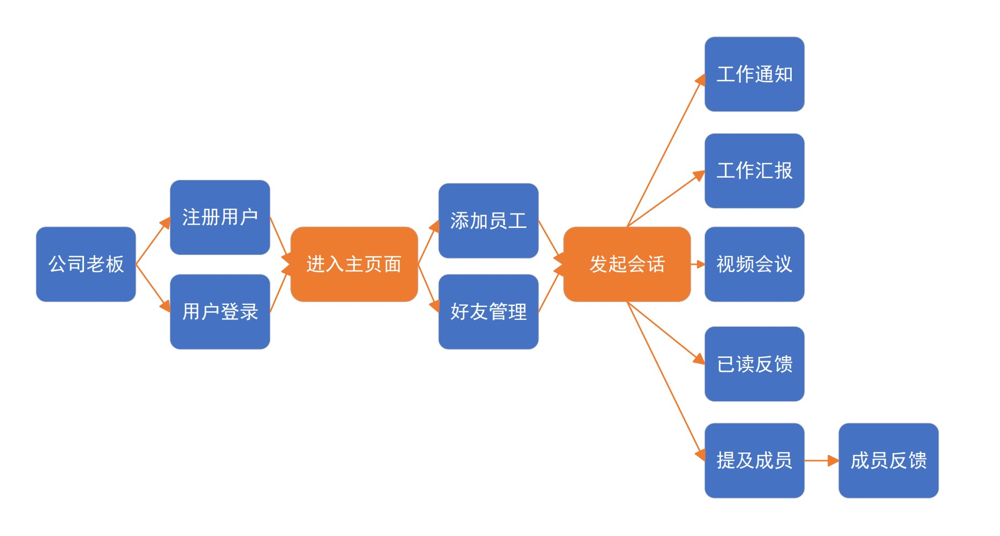
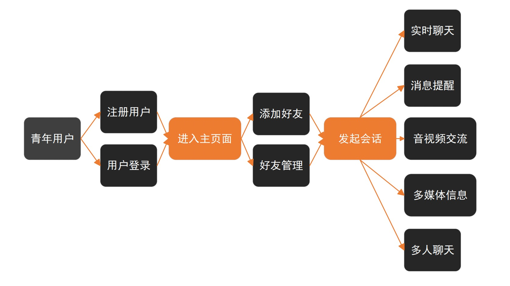
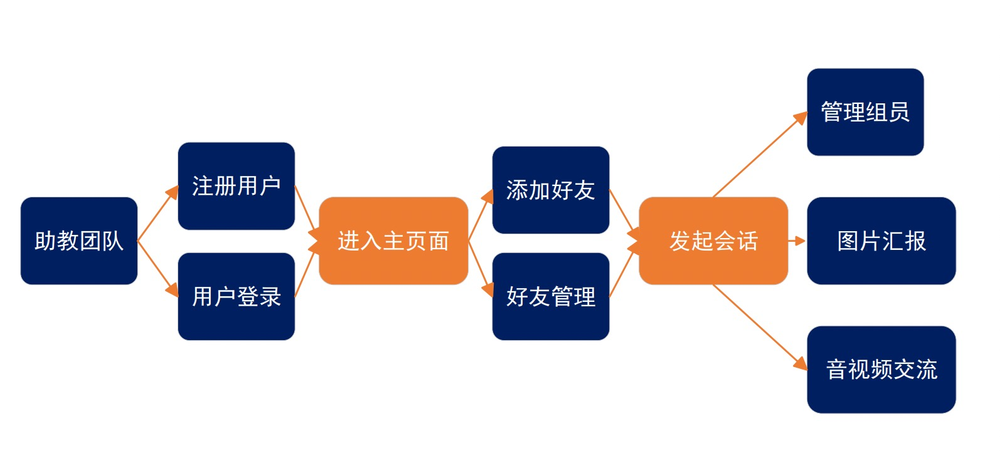
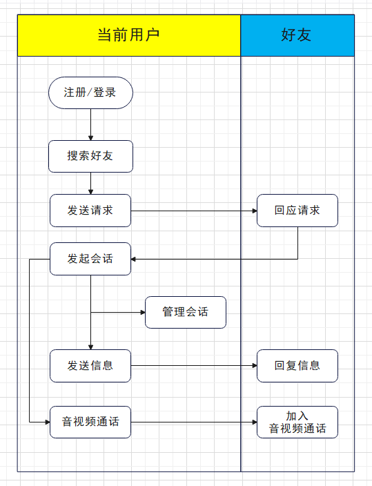

# KillThisSE IM 项目概述

## 项目背景

随着科技的不断发展和人们生活方式的改变，即时通讯成为了现代社交和沟通的重要方式。在这个背景下，我们开发了一个全新的即时通讯应用项目**KillThisSE IM**，旨在提供一种高效、便捷且安全的沟通方式，满足用户在各种场景下的通讯需求。用户可以通过该应用与他人进行实时的文字、图片、音频和视频交流，轻松分享各种媒体内容，以及进行高质量的音视频通话。

## 项目目标

本项目需要在完成用户系统的基础上，实现不同用户间的实时通讯。基本的实时通讯包括文字信息的即时传递，高阶的实时通讯包括多媒体信息的传递、辅助信息的显示、音视频通话等。

## 需求分析

### 用户故事

!!! note "办公场景"

    小汪是一家初创公司的老板。随着公司的发展，人员数量开始膨胀，他发现在管理过程中经常出现上下级沟通不畅，同事之间协同存在阻滞。小汪深感必须为公司开发一个办公通讯软件，将管理成本和沟通成本降到最低。这样的办公通讯软件应当满足如下条件：上级能即时地向下级传达工作安排，下级也能即时向上级反馈工作情况，上级能查询下级是否已经知悉其被分派到任务，上级能通过提及部分员工精确地指派工作内容……

!!! note "亲友交流"

    小李善于社交，但她也因为无法时时与亲朋好友见面交谈而感到痛苦。在千里之外的城市读书，使她常常思念家中的亲人；与多年好友分隔两地，使她对维系友谊越发力不从心。她想，要是能在一个即时通讯软件上与亲友视频通话就好了。通过音视频聊天，对远在千里之外的亲人的思念将化为笑颜，对多年好友的牵挂将变做友谊历久而弥坚的见证。

!!! note "师生沟通"

    小戴和小刘是软件工程课的两名助教。身为助教，需要与项目组内的各个小组保持密切联系，以观测各个小组的进度，监督全过程的开发规范，及时给予批评和建议。然而由于每周只有周四例会这一固定时间能与各个小组进行交流，小戴和小刘对大家的进度掌握程度仍嫌不足。身为软工助教，他们摩拳擦掌准备开发一款可以用于助教与小组即时通讯的软件，在这个软件里，小组可以通过图片、视频、语音、文件等多媒体方式向助教展示自己的进度；助教可以通过群公告提示每一周例会的时间和地点；对于摆烂的同学，助教拥有权限将他们移除出群聊……

### 用户用例图

### 泳道图

## 需求清单

| 需求名称         | 需求描述                                                     | 交付时间 |
| ---------------- | ------------------------------------------------------------ | -------- |
| ⽤⼾注册         | 要求能够令⽤⼾注册，需要对⽤⼾填写的注册信息提出合理的格式要求 | Sprint 1 |
| ⽤⼾注销         | 已登录的⽤⼾可以选择注销在该系统中⾃⼰的账号，注销后服务器端应当正确处理涉及到该⽤⼾的所有数据，如聊天记录与好友关系等 | Sprint 2 |
| 登录登出         | ⽤⼾能够使⽤已经注册的账号和正确的认证信息登录系统，并可以登出系统。⽤⼾登录后应当和服务器端同步消息记录 | Sprint 2 |
| 验证⼿段         | 提供多种登录认证⼿段（⾄少两种），认证⼿段可以是⽤⼾名密码认证、⼿机短信验证码认证、邮箱验证码认证等 | Sprint 4 |
| ⼆次验证         | 允许⽤⼾设置⼆次验证，如允许⽤⼾设置进⼊特定的私聊或者群聊时需要通过密码等⼿段再次验证⾝份 | Sprint 4 |
| 信息编辑         | 已登录的⽤⼾可以修改⾃⼰的⽤⼾名、密码、头像、邮箱、⼿机等个⼈信息。对于涉及到⾝份认证信息的修改（如密码、邮箱、⼿机等），应当⾄少通过⼀种认证⼿段验证⾝份 | Sprint 2 |
| ⽤⼾查找         | 允许⽤⼾通过⽤⼾名等关键词查找其他⽤⼾并浏览其基本信息       | Sprint 2 |
| 好友申请         | ⾄少允许⽤⼾通过⽤⼾查找、群聊两种⽅式申请添加另⼀⽤⼾为好友，经对⽅同意后建⽴双向好友关系 | Sprint 2 |
| 好友删除         | 允许⽤⼾删除好友                                             | Sprint 2 |
| 好友列表         | 需要展现⽤⼾的好友列表，允许⽤⼾对⾃⼰的好友分组             | Sprint 3 |
| 界⾯显⽰         | 聊天界⾯⾄少需要展⽰参与⼈的头像、所发送的信息，并且需要对⽤⼾本⼈发出的信息在显⽰上特殊处理，如消息⽓泡颜⾊不同 | Sprint 4 |
| 发送信息         | 允许⽤⼾在聊天界⾯发送⽂本信息                               | Sprint 3 |
| 辅助信息         | 对每⼀条信息合理展⽰辅助信息，如发送时间、对⽅是否已读（针对私聊）、已读该消息的成员列表（针对群聊）等 | Sprint 4 |
| 未读计数         | 每⼀个会话，包括私聊和群聊，均需要展⽰该会话⽬前未读消息的数量 | Sprint 4 |
| 多媒体           | 除⽂本外，⽀持图⽚、语⾳、视频、表情、⽂件等信息内容         | Sprint 4 |
| 链接格式化       | 对于消息内容中的 URL 链接，应当以特殊格式显⽰（如蓝⾊下 划线）并且允许单击跳转 | Sprint 4 |
| 提及             | （仅限群聊）⽤⼾在⽂本输⼊框内输⼊ @ 字符后应当弹出窗⼝（或其他交互⽅式），显⽰本群聊成员列表，⽤⼾在该列表中选择提及某⼈或提及全体成员。消息内容中的提及应当以特殊格式显⽰（如蓝⾊字体）并且允许单击跳转到该成员基本信息⻚⾯或⿏标悬浮显⽰该成员基本信息 | Sprint 4 |
| 提及反馈         | 应当设计适当的反馈，令⽤⼾了解⾃⼰所提及的成员是否已读该消息 | Sprint 4 |
| 拓展列表基本要求 | 右键或⿏标悬浮（PC 端）或⻓按（移动端）某条消息会弹出拓展列表，本⼀级需求下其他的⼆级需求均是该拓展列表中的功能 | Sprint 4 |
| 消息撤回         | 消息发出后，在⼀定时间内，发出者可以选择撤回该消息           | Sprint 4 |
| 回复消息         | 允许⽤⼾回复某⼀条消息。被回复的消息应当展⽰该消息被多少条消息所回复，单击回复某条消息的消息应当可以跳转到其所回复的消息处 | Sprint 4 |
| 外语翻译         | 允许⽤⼾将外语⽂本消息翻译为汉语                             | Sprint 4 |
| 消息转发         | 允许⽤⼾在弹出拓展列表后选择多选消息，⽤⼾多选该会话中部分消息后，允许将⽤⼾选定的消息合并转发⾄其他会话中 | Sprint 4 |
| 语⾳转⽂字       | 允许⽤⼾将语⾳消息按照标准汉语普通话转换为⽂本形式展⽰       | Sprint 4 |
| 查看记录         | 允许⽤⼾查看该会话下所有的聊天记录                           | Sprint 4 |
| 筛选记录         | 允许⽤⼾通过时间、消息类型、发送成员（针对群聊）等各种标准筛选聊天记录 | Sprint 4 |
| 删除记录         | 允许⽤⼾删除聊天记录                                         | Sprint 4 |
| 消息免打扰       | 允许⽤⼾设置不提醒未读消息的会话                             | Sprint 4 |
| 置顶会话         | 允许⽤⼾设置在会话列表中将部分会话置顶显⽰                   | Sprint 4 |
| 语⾳通话         | 允许两个⽤⼾间进⾏实时语⾳通话                               | Sprint 4 |
| 视频通话         | 允许两个⽤⼾间进⾏实时视频通话                               | Sprint 4 |
| 列表创建         | 允许⽤⼾从好友列表中选取部分好友创建群聊                     | Sprint 4 |
| 私聊创建         | 允许⽤⼾以某⼀个私聊为基础，增添若⼲其他好友创建群聊         | Sprint 4 |
| 信息展⽰         | 应当设置某⼀个界⾯展⽰当前群的基本信息，⾄少需要包括群聊名称、群成员、历史群公告等 | Sprint 4 |
| 群管理员         | 创建群聊的⽤⼾默认为群主，群主可以从群成员中指定群管理员    | Sprint 4 |
| 群主转让         | 群主可以主动将群主⾝份转让给其他群成员                       | Sprint 4 |
| 群公告           | 群主与群管理员有权限发布全体公告                             | Sprint 4 |
| 移除群员         | 群主与群管理员有权限直接移除指定群成员，群主可以移除除⾃⼰的任何群员，群管理员仅能移除⾮群主、⾮群管理员的群成员 | Sprint 4 |
| 撤销消息         | 群主与群管理员可以⽆视撤回消息的时间约束直接撤回消息，群主可以撤回任何消息，群管理员仅能撤回⾮群主、⾮群管理员的群成员的消息 | Sprint 4 |
| 成员邀请         | 群成员可以邀请⾃⼰的好友加⼊群聊，需要经过群主与群管理员的审核 | Sprint 4 |
| 成员退出         | 群成员可以⾃由退出群聊                                       | Sprint 4 |

