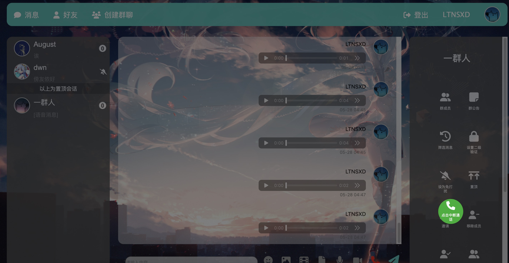

# 用户手册

欢迎使用KillThisSE IM!

本平台地址: [KillThisSE IM | 即时通讯系统](https://2023-im-frontend-killthisse.app.secoder.net)

## 注册与登录

如果您第一次使用KillThisSE IM的，请先使用**用户名和密码**注册新账户。随后，便可以在主界面使用注册好的用户名与密码登录，开始享受实时聊天服务。

## 个人信息管理

登录以后，可以点击右上角进入个人信息页面，进行用户名、头像、密码、邮箱等个人信息的更改。

## 管理好友

### 添加好友

通过搜索用户的 `id`或用户名，您可以查询用户的基本信息。在申请对方为好友以后请耐心等待对方回应。

### 添加分组

您可以为好友分组。在创建新的分组以后，您可以将好友添加到这些分组里，也可以将好友从分组中移除。

## 开始聊天

### 开始私聊

从好友信息页面可以发起与指定好友的私聊。发起以后将会直接跳转至绘画页面。

### 发起群聊

您可以直接指定好友发起群聊，或者从私聊界面出发发起群聊。创建群聊后，用户为默认的群主。

### 聊天主界面

## 实时聊天

### 信息发送

在聊天主界面，您可以通过信息输入框发送文本信息，也可以通过图片、文件等按钮发送多媒体信息。

### 已读

在私聊中，可以看到对方是否已读自己所发的某条消息；在群聊中，可以看到已读该消息的成员列表。

### 提及

在群聊中，用户可以`@`指定的成员，并使其收到提醒。

### 语音转文字

通过点击消息的拓展列表，可以将对方/自己发送的语音消息识别为文字并展示

### 翻译

通过点击消息的拓展列表，可以将对方/自己发送的外语消息翻译为汉语

### 音视频聊天

通过点击聊天界面的视频通话与语音通话按钮，您可以在私聊或群组内进行多人音视频聊天。

